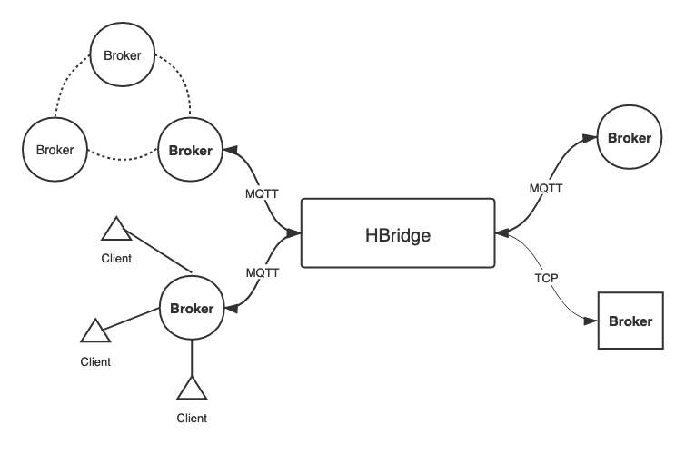

# HBridge

HBridge is a MQTT bridge for forwarding messages of certain topics from one broker to another one, written in `Haskell`.

**It is under development and is really simple now. Everything including structure can vary at any time.**

## Introduction

HBridge supports two types of connection:

- MQTT connection: MQTT connection is the most-used type of connection for performing inter-broker MQTT message forwarding. It supports standard MQTT publishing messages.
- Bare TCP connection: Although MQTT is (mostly) based on TCP connection, the bridge also supports bare TCP connection. For convenience, the one who connects to the bridge by TCP is also called "broker" no matter what it does. Messages from bare TCP connections can only be forwarded to other TCP ones. It supports following types of message:

  + A simple type of message `PlainMsg` containing only a payload field in plain text and a topic. It is mostly used for testing purposes.
  + Several types of controll message, for controlling the internal state of the bridge.

Both types of connection supports **multi-broker** work mode. It means that a bridge can connect to multiple brokers at the same time, and these connections can be different types. By proper configuration which will be talked later, a message from a broker can be forwarded to many other brokers.

The concept of the bridge is shown below:



HBridge also provides some extra features:

- Message processing: It means that HBridge can do some processing on the message. It currently provides following functions:
  + `saveMsg`: Save all messages to disk.
  + `modifyTopic`: Modify matched topic to a new one.
  + `modifyField`: Modify certain field of payload in a message to a new value (if the field exists).

- Mountpoint: It means that you can set a mountpoint for each broker the bridge connects to. The mountpoint will be combined with the original topic when a message is forwarded. This is useful to prevent messages from looping between brokers. For example, mountpoint `mp/test/` can modify topic `home/room/temp` to `mp/test/home/room/temp`.

## Build and Test

### Build
To build from source, haskell build tool `stack` is required. Type
```
$ stack build
```

### Test

There is a very simple test program in `test/Spec.hs`. To run the test with default configuration, it requires several MQTT brokers at running status. We recommend `EMQ X` broker:
```
$ docker run -d --name emqx1883 -p 1883:1883 -p 8083:8083 -p 8883:8883 -p 8084:8084 -p 18083:18083 emqx/emqx
$ docker run -d --name emqx1885 -p 1885:1883 -p 8085:8083 -p 8885:8883 -p 8086:8084 -p 18085:18083 emqx/emqx
```

A TCP server is optional for monitoring and controlling the state of the bridge. A minimal one is provided at `app/monitor`. Note that the first TCP broker in the configuration file is reserved for this usage. To run it, just execute
```
$ stack run -- monitor --host=localhost --port=19192
```
Port `19192` is the port of the first TCP broker in default configuration file.

Then run the test program:
```
$ stack test
```

Now the main program can be executed:
```
$ stack run -- HBridge --config etc/config.yaml +RTS -T
```

In this example, there exists two MQTT brokers `B1` and `B2` and a TCP one `B3` that connects to the bridge. The bridge forwards messages from `B1` to `B2` and vice versa. `B3` sends plain messages to the bridge periodically.

The running status can be found at `localhost:22333`. This is provided by `ekg` package. `+RTS -T` is not required if you do not need this function.

After the connections are established, it is possible to run commands in the `monitor` console. It only supports few commands such as listing and modifying processing functions in bridge. You can type `<TAB>` for completions. **Note that this function is at very early stage.**


## Configuration

**CAUTION**: This part is currently at very early stage and can change at any time.

The configuration file is at `etc/` in `YAML` format. A default configuration file `etc/config.yaml` is also provided. A configuration file contains the following fields:

- `logFile`: Log file path.
- `logLevel`: Log level, it can be one of `DEBUG`, `INFO`, `WARNING` and `ERROR`. Logs whose level is lower than it will not be recorded.
- `logToStdErr`: It decides whether to log to console. It can be one of `true` and `false`.
- `brokers`: A list of configurations of all brokers to connect to. It will be discussed later.
- `msgFuncs`: A list of message processing functions. It will be discussed later.

The `brokers` field in configuration is a list of configurations of all brokers. Each of it contains:

- `brokerName`: Name of the broker.
- `brokerURI`: URI of the broker to connect to. Due to some reasons, it is shown in a more complex form.
- `connectType`: Type of the connection. It can be one of `MQTTConnection` and `TCPConnection`.
- `brokerMount`: Mountpoint of the broker. It will be added to the topic of messages it forwards.
- `brokerFwds`: Topics this broker forwards. It is a list of strings (topics).
- `brokerSubs`: Topics this broker subscribes. It is a list of strings (topics).

The `msgFuncs` field in configuration is a list of descriptions of message processing functions. Each of it contains:
- A name of this function. It can be any string.
- `tag`: Type of this function. It can be one of `SaveMsg`, `ModifyTopic` and `ModifyField`, and this list can contain more members later.
- `contents`: A list representing arguments of certain functions. This can be found in definition of `MessageFuncs` in `Types.hs`.

**Note that the order of functions counts.** This is because a message is proessed one by one from the first function.


Besides write configuration file manually, you can also write several lines of code in `test/Spec.hs`. Then run
```
$ stack repl
...
*Main Environment Extra Types> :l test/Spec.hs
*Main> writeConfig
```
The configuration file will be written at `etc/config.yaml`.

To use message processing features, there are two ways but both are not easy to use `currently`:

- Write functions in configuration file.
- Hard code the functions in `newEnv1` function in `src/Environment.hs`. And there are some ones in it by default.
- Send insertion request to the bridge by TCP connection. But it is required that the request is correctly encoded to plain text. You can refer to `runTCP` in `app/Main.hs` and `Message` definition in `src/Types.hs`.
